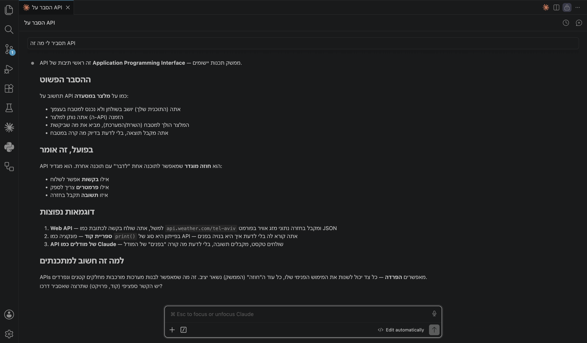
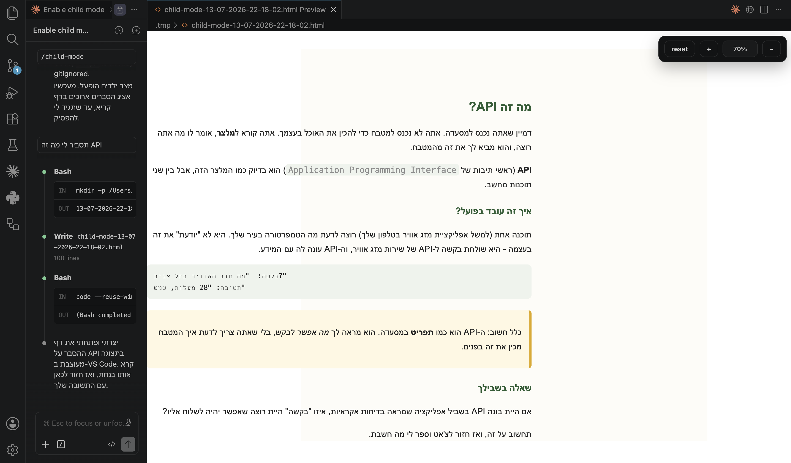

# explain-mode

**A patient teaching mode for AI coding agents — built for kids and for speakers of right-to-left (RTL) languages like Hebrew and Arabic learning to code.**

[קרא בעברית](README.he.md)

Terminal-based coding chats serve these two groups especially badly: long
explanations are hard for a child to read comfortably in a scrolling chat
window, and RTL text often renders garbled or confusingly mixed with English
code and commands. explain-mode fixes both — while staying general enough to
help any beginner.

Works with **Claude Code, Cursor, Codex**, and any AI coding agent that
supports Markdown-based custom skills or slash commands.

## What it does

Instead of dumping a long explanation into the chat, explain-mode writes
each lesson to its own standalone, readable HTML page and opens it
automatically — while the chat itself stays short and is used only for the
learner's answers and next steps.

## See it in action

Same question — "explain what an API is" — asked in Hebrew, without and
with explain-mode:

| Without explain-mode | With explain-mode |
| --- | --- |
|  |  |
| Long answer crammed into the narrow chat panel — small font, no breathing room, and lines where Hebrew wraps directly around English mid-sentence, e.g. `אתה שולח בקשה לכתובת בפורמט api.weather.com/tel-aviv ומקבל בחזרה נתוני מזג אוויר כמו JSON` — readable if you concentrate, but exactly the kind of mixed-direction line a young or new reader stumbles on. | That exact problem, fixed: the request/response example on the page (`"מה מזג האוויר בתל אביב?"` → `"28 מעלות, שמש"`) sits in its own LTR-isolated box instead of inline in a Hebrew sentence. Same explanation as a wide, readable page overall: clear headings, a highlighted key idea, English/code terms visually isolated in their own boxes instead of embedded mid-sentence, and a question that invites the learner back to the chat instead of just dumping information. |

## Why it's worth using

- **Readable lessons, not a wall of chat text.** Each explanation gets a
  dedicated page: large font, short paragraphs, generous spacing, one idea
  at a time — instead of scrolling through a cramped terminal.
- **Real RTL support, not an afterthought.** Hebrew, Arabic, and other
  right-to-left languages render with correct text direction and
  right-alignment, while code, commands, and file paths stay correctly
  isolated left-to-right inside the same page — no more mixed-direction
  text turning into a garbled mess.
- **Kid-appropriate teaching style, on by default.** Short sentences, one
  concept per page, one example, one small question or task — the agent is
  instructed to teach like a patient tutor, not race ahead like an
  autonomous contractor.
- **The chat stays a conversation, not a textbook.** Long content never
  clutters the chat history; the chat is reserved for the learner's
  answers, questions, and back-and-forth.
- **The learner's project stays safe.** Lessons are rendered in their own
  throwaway page, never inside the learner's real project files. Changes to
  actual project files are explained first, kept small, and never silently
  overwritten with a complete solution.
- **Zero server, zero dependencies.** Every lesson page is a single
  self-contained HTML file — no build step, no local server, nothing to
  install beyond the skill itself and (optionally) a one-time editor
  setting for click-free preview.
- **Works with the agent you already use.** No new app to learn — it's a
  Markdown skill file your existing AI coding agent reads and follows.
- **General enough to grow.** Kids and RTL speakers are where this started,
  not a hard limit — the language, direction, and learner profile are all
  configurable, so it fits other beginners too.

## Install

Give your AI coding agent this repository's URL and ask it to install the
skill. For example, paste this into Claude Code, Cursor, or a similar tool:

```
Please install the skill from https://github.com/maoratlas/explain-mode
into this project.
```

A capable agent will fetch `skills/explain-mode/SKILL.md` from this repo and
copy it into the right place for your tool automatically (for Claude Code,
that's `.claude/skills/explain-mode/SKILL.md`, at the project or user
level; Cursor and Codex read their own `skills/` directories and, for
compatibility, `.claude/skills/` too).

Alternatively, use the standard [skills CLI](https://github.com/vercel-labs/skills),
which detects this repo's layout and installs into the right directory for
whichever agent you use:

```
npx skills add maoratlas/explain-mode
```

And if your agent needs a more explicit instruction, use:

```
Fetch https://raw.githubusercontent.com/maoratlas/explain-mode/main/skills/explain-mode/SKILL.md
and save it as .claude/skills/explain-mode/SKILL.md in this project.
```

No dependencies, no build step, no server — it's a single Markdown file
following the open [Agent Skills](https://agentskills.io) format.

### Optional: click-free HTML preview

By default, opening a lesson page may require one manual click to switch
from raw HTML source to a rendered preview, depending on your editor. The
skill file includes a short, copy-pasteable **one-time setup** section
("One-time setup: click-free HTML preview") that removes that click
entirely for VS Code and VS Code-based editors (Cursor, etc.). Ask your
agent to walk you through it, or open `skills/explain-mode/SKILL.md` and
follow that section yourself.

## Usage

Once installed, activate it in any conversation with your agent:

```
/explain-mode
```

The agent will confirm it's on, then start writing lessons to a readable
page whenever it has something substantial to explain — code concepts,
instructions, exercises, or error walkthroughs — while keeping the chat
itself short. Say "stop explain mode" (or equivalent) at any point to turn
it off.

## License

[MIT](LICENSE)
